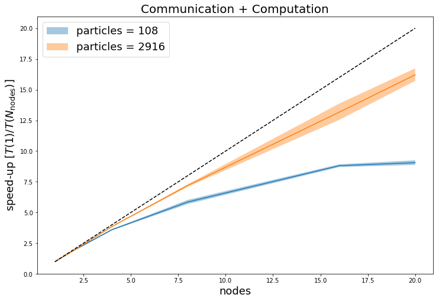
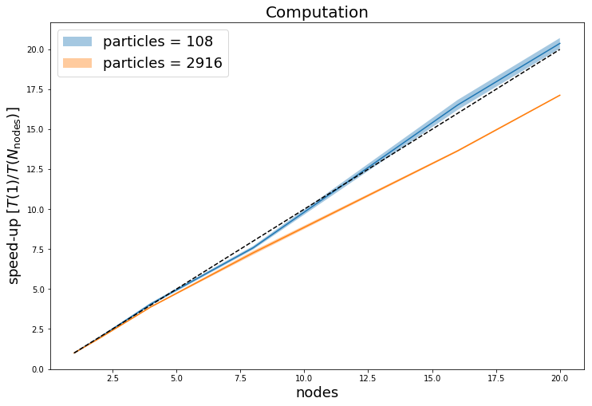
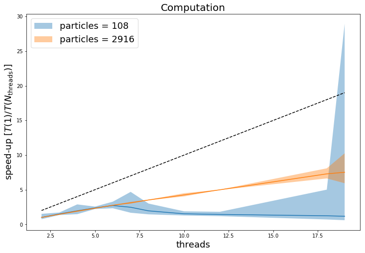

# P1.8_ljmd
# Jesus Espinoza, Herbert Nguruwe, Tommaso Ronconi, Matteo Zampieri

## MPI benchmarking

We test the performance of our MPI parallelization by collecting the time spent by the `force()` function (declared in [compute_force.h](include/compute_force.h) and defined in [compute_force.c](src/compute_force.c)) both with and without the communication part.
We then compute the **strong scaling** averaging between 10 runs per number of processors, the results are shown in the following plots, were we also show with a black dashed line the ideal linear scaling.

|          |          |
| ------------------------------------------------------- | -------------------------------------------------- |
| [full size](MPI-benchmark/strong_scaling_comm+comp.png) | [full size](MPI-benchmark/strong_scaling_comp.png) |

It can be noticed that, even though the computation part scales better for the smaller system size (blue curve), the overall performance is better for larger size of the system, suggesting that the communication time depends less on the size of the system.

## OpenMP benchmarking

We test the performance of our OpenMP parallelization by collecting the time spent on computing `force()` within `compute_force.c`;  we consider computation+communication time. 

We compute the **strong scaling** by averaging over 10 runs number of threads, namely 1, 2, 3, 4, 5, 6, 7, 8, 10, 12, 18, 19. 

We notice how, for a problem of small size (i.e. number of atoms = 108), there is a slight speedup up to 6 threads; afterwards, there is a noticeable decrease in the performance.

On the contrary, for a problem of a bigger size (i.e. number of atoms = 2916), even though not ideal, the speedup increases quite evidently up to 12 threads and plateaus with 18 and 19 threads.

The plot suggests that the difference in performance, given the two problem sizes, might be due to the communication time relative to the size itself: for a small problem size, the communications becomes relatively more expensive.